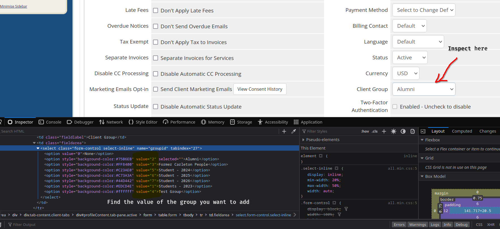

# Add WHMCS clients to client groups

### The code on this folder is used to assign each WHMCS client to a WHMCS client group.

It has one code written to assign students to groups based on their class year and one to assign alumni and former Carleton people to their respective groups. However, it is easily customizable to create new groups and assign people using the code.

## WHMCS configuration to make the code work
You need to add the role of the user on the "Admin Notes" WHMCS section. For the given code (for students and alumni/former people) the format is "Student - 202X", "Alum - 20XX", "Former XXXXXX". In case you want to add new group/role simply add it on the admin notes and make your own pattern matching in the python code to find the users you want to add to the group.

### How to add a new group and assign users to it?
##### What  you need to do on WHMCS
Go to WHMCS, go to the "setup" page on the header, then click on client groups. Add the desired group. Then open the account of any user and go to the profile page. Click on inspect the page on the browser clicking on the client group section to find out the HTML values of each group. We will need it to be able to match the role to a group. See the example below.

##### What you need to change on the code
Now you have all the information you need from WHMCS, all you need to do is add it to the code. If the new group you created was a new student class year all you need to do is add the new class year both on the "id_group" dictionary, saving the pair (class_year, inspect_html_value) so that the code can select the group correctly as well as adding the year to the "years" list. If you created a group that is not a student class year you will need to create a copy of the alumni_former_people.py code and update the if to check when a user is of a group you want to categorize based on the desired conditions and then add the value you found by inspecting WHMCS on the find_element part.
